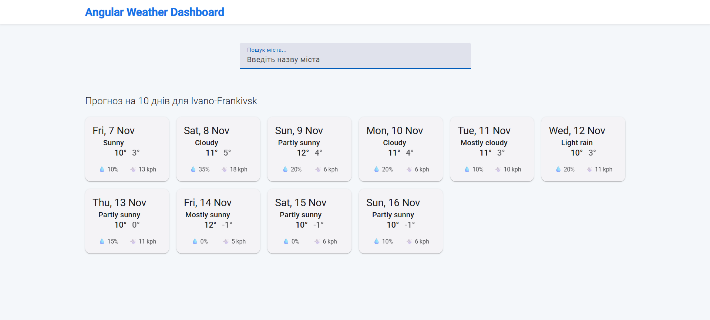

# Weather Dashboard

A modern weather dashboard application built with Angular that provides weather forecasts and location-based weather information.

## Authors

- Володимир Фуфалько
- Вікторія Яківчук



## Description

Weather Dashboard is a web application that allows users to:

- Search for locations
- View current weather conditions
- Check weather forecasts
- Track weather information for multiple locations

## Technologies

- Angular 20.3.0
- Angular Material 20.2.12
- RxJS 7.8.0
- TypeScript 5.9.2

## Project Structure

```text
src/
├── app/
│   ├── core/
│   │   ├── interceptors/     # HTTP interceptors for API key handling
│   │   ├── models/          # Data models and interfaces
│   │   └── services/        # Core services for weather and places
│   └── features/
│       ├── location-search/  # Location search functionality
│       └── weather-forecast/ # Weather forecast display
└── environments/            # Environment configuration files
```

## Getting Started

### Prerequisites

- Node.js (Latest LTS version recommended)
- npm (comes with Node.js)

### Installation

1. Clone the repository:

    ```bash
    git clone https://github.com/finkord/weather-dashboard.git
    ```

2. Navigate to the project directory:

    ```bash
    cd weather-dashboard
    ```

3. Install dependencies:

    ```bash
    npm install
    ```

4. Set up environment variables:
   - Copy `environment.example.ts` to `environment.ts`
   - Update with your API keys and configuration

### Development Server

Run `npm start` or `ng serve` for a development server. Navigate to `http://localhost:4200/`. The application will automatically reload if you change any of the source files.

### Building the Project

Run `npm run build` or `ng build` to build the project. The build artifacts will be stored in the `dist/` directory.

### Running Tests

Run `npm test` or `ng test` to execute the unit tests via Karma.

## Features

- Location-based weather search
- Current weather conditions display
- Weather forecast visualization
- Responsive design using Angular Material
- API key protection using HTTP interceptors

## License

This project is private and not licensed for public use.

## Technical Details

- Built with Angular CLI version 20.3.5
- Uses Angular Material for UI components
- Implements RxJS for reactive programming
- Follows Angular best practices and coding standards
- Includes HTTP interceptors for API authentication
- Configured with TypeScript strict mode
