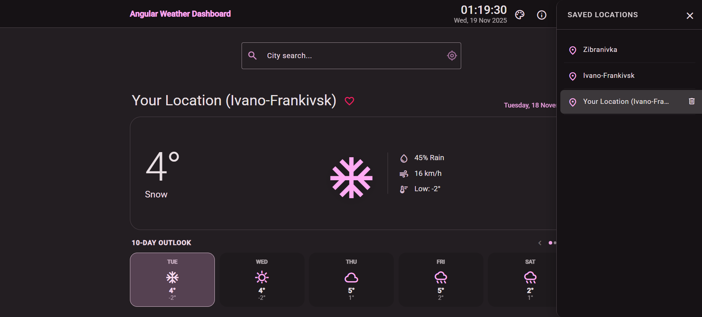
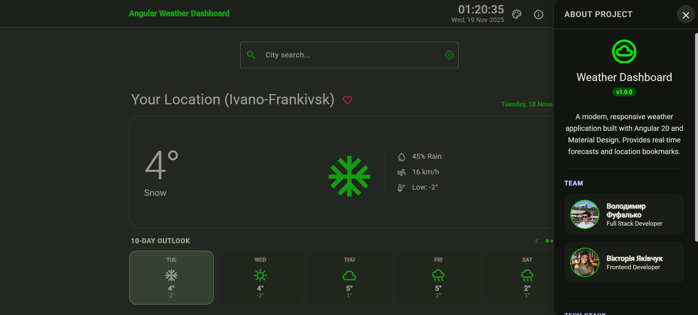

# Weather Dashboard 2.0

A production-ready, responsive weather application engineered with **Angular 20** and a **Node.js BFF (Backend-for-Frontend)** architecture.


## Team

- Volodymyr Fufalko - Full Stack Developer
- Viktoriia Yakivchuk - Frontend Developer

## Key Features

- **Modern Angular Architecture**: Built with the latest **Signals API**, **Control Flow** syntax (`@if`, `@for`), and Standalone Components.
- **Secure BFF Layer**: A Node.js/Express intermediate server handles external API calls, securely hiding API keys (`GOOGLE_API_KEY`) and transforming raw data before it reaches the client.
- **Smart Caching**: Implements server-side caching (`node-cache`) to minimize API usage and reduce latency (1-hour TTL for weather, 1-year TTL for geo-data).
- **Responsive Design**: Fully adaptive UI using Angular Material and CSS Grid/Flexbox, optimized for mobile and desktop.
- **Location Services**:
  - Autocomplete search for cities.
  - Browser Geolocation integration with reverse geocoding.
  - Bookmark system for saving favorite locations (synced with LocalStorage).

## Application Gallery

| Bookmarks Management | About Project |
|:--------------------:|:-------------:|
|  |  |
| *Manage your favorite locations* | *Project info & Team* |

## Tech Stack

**Frontend:**

- **Framework**: Angular 20.3.0
- **State Management**: Angular Signals
- **UI Library**: Angular Material 20.2.12
- **Networking**: Angular HTTP Client (with RxJS Interceptors)
- **Styles**: SCSS with CSS Variables for theming (Light/Dark/System modes)

**Backend-for-Frontend (BFF):**

- **Runtime**: Node.js
- **Framework**: Express.js
- **Utils**: `node-fetch` (v2), `node-cache`, `dotenv`

## Architecture

This project uses a BFF pattern to ensure security and performance:

1. **Client (Angular)** requests data from its own domain (`/api/weather`, `/api/places`).
2. **BFF (Express)** checks the internal cache.
3. If cached, returns data instantly.
4. If not, requests data from **Google Weather/Places API** securely injecting credentials.
5. **BFF** transforms the complex Google response into a lightweight, type-safe DTO (`DailyForecast`) for the client.

## Project Structure

```text
src/
├── app/
│   ├── core/
│   │   ├── models/          # Clean TypeScript interfaces (DTOs)
│   │   └── services/        # Singleton services (Weather, Places, Bookmarks, Theme)
│   ├── features/
│   │   ├── about/           # "About Us" & Project Info modal
│   │   ├── bookmarks/       # Saved locations management list
│   │   ├── clock/           # Real-time clock component with DatePipe
│   │   ├── location-search/ # Autocomplete & Geolocation logic
│   │   ├── theme-toggle/    # Color scheme & Dark mode switcher
│   │   └── weather-forecast/# Main dashboard with Signals-based UI
│   └── shared/
│       └── pipes/           # Utilities (e.g., WeatherIconPipe)
├── bff-server/              # Node.js Express Server
│   ├── index.js             # Server entry point & Caching logic
│   └── places-controller.js # Reverse geocoding logic
└── environments/            # Environment configuration
```

## Getting Started

### Prerequisites

- Node.js (Latest LTS version recommended)
- npm (comes with Node.js)

### Installation

1. Clone the repository:

    ```bash
    git clone https://github.com/finkord/weather-dashboard.git
    ```

2. Navigate to the project directory:

    ```bash
    cd weather-dashboard
    ```

3. Install dependencies:

    ```bash
    npm install
    ```

4. Set up environment variables:
   - Copy `environment.example.ts` to `environment.ts`
   - Update with your API keys and configuration

### Development Server

To run the full application, you need to start both the Backend and the Frontend:

1. **Start the BFF Server** (in one terminal):

   ```bash
   node bff-server/index.js

2. **Start the Angular App** (in a second terminal):

    npm start

Navigate to ```http://localhost:4200/```. The application will automatically reload if you change any of the source files.

### Building the Project

Run `npm run build` or `ng build` to build the project. The build artifacts will be stored in the `dist/` directory.

### Running Tests

Run `npm test` or `ng test` to execute the unit tests via Karma.

## License

This project is private and not licensed for public use.

## Technical Details

- Built with Angular CLI version 20.3.5
- Uses Angular Material for UI components
- Implements RxJS for reactive programming
- Follows Angular best practices and coding standards
- Includes HTTP interceptors for API authentication
- Configured with TypeScript strict mode
