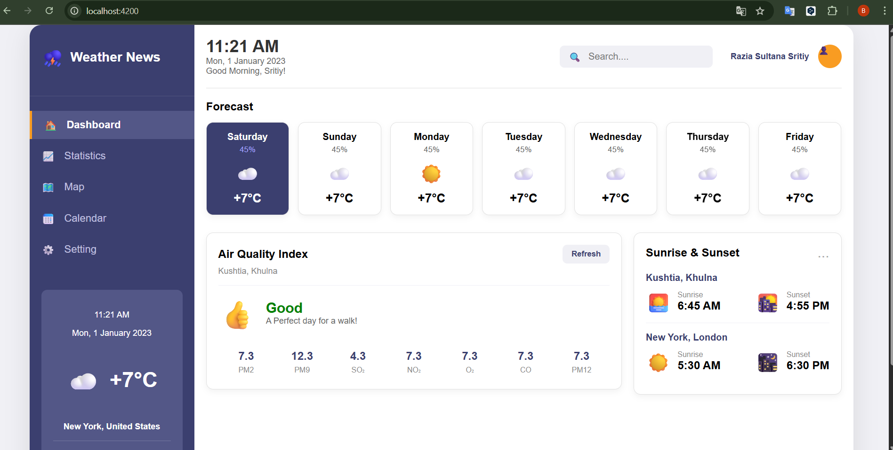

# ⛈️ Weather Dashboard | Інформаційна панель погоди

Цей проєкт є інформаційною панеллю погоди, розробленою на Angular (Standalone Components) та стилізованою за допомогою чистого CSS. Метою є імітація професійного дашборду для відстеження прогнозу, якості повітря та іншої кліматичної інформації.

---

## 👥 Розробники

Проєкт розроблено студентами групи **ІПЗ-33**:

* **Яківчук Вікторія**
* **Фуфалько Володимир**

---

## 🛠️ Технології

* **Frontend Framework:** Angular (Standalone Components)
* **Мова:** TypeScript
* **Стилі:** CSS (Модульні стилі для кожного компонента)
* **Система контролю версій:** Git

---

## 🎯 Архітектура та Функціонал

### Структура компонентів:

Проєкт дотримується модульної структури, розбитої на такі ключові компоненти:

* `AppComponent` (Root)
* `Sidebar` (Навігація та Today Widget)
* `Header` (Пошук, Час, Профіль)
* `MainContent` (Область для віджетів)
    * `SevenDayForecast`
    * `AirQualityIndex`
    * `SunRainDetails` (Схід/Захід сонця та Опади)

### Дані:

На етапі розробки використовується **Імітація Back-end (Mock Data)** для забезпечення статичного типізування та динамічного відображення контенту у віджетах.

---

## 🖼️ Поточний Прогрес

На цьому етапі успішно реалізовано повний каркас компонентів та основну стилізацію згідно з макетом.



### Досягнуто:

* Повний **Layout** (Sidebar, Header, Main Content).
* Стилізація **Sidebar** та **Header** за макетом.
* Верстка віджетів **Forecast**, **Air Quality Index** та **Sun & Sunset**.
* Успішно усунуто всі помилки імпорту Standalone-компонентів.

---

## ▶️ Інструкції для запуску

1.  **Клонування репозиторію:**
    ```bash
    git clone https://github.com/finkord/weather-dashboard
    ```
2.  **Перехід у папку проєкту:**
    ```bash
    cd weather-dashboard
    ```
3.  **Встановлення залежностей:**
    ```bash
    npm install
    ```
4.  **Запуск Angular Development Server:**
    ```bash
    npx ng serve --open
    ```
    Додаток буде доступний у вашому браузері за адресою `http://localhost:4200/`.